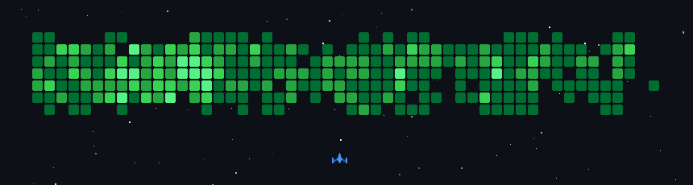

<p align="center">
  
</p>

<p align="center">
<br/>
<a href="https://www.linkedin.com/in/aleeabdullah">
  
</a>
<a href="https://ali.scoopcodes.com">
  
</a>
<br>
</p>


[](https://github.com/ashutosh00710/github-readme-activity-graph)

```yaml
name: Ali Abdullah
located_in: Lahore, Punjab, Pakistan
from: Lahore, Pakistan
job: Software Engineer
education: ["Bachelor's in Computer Science (BS CS)", "FSC Pre Engineering"]
university: FAST-NUCES, Lahore (2021-2025)
company: Ripeseed.io
past experiences:
  - ["Software Engineer", "Full-stack Development (Django/Next.js)", "Ripeseed.io", "Lahore, Pakistan", "Aug 2025-Present"]
  - ["Software Engineer", "Backend & Frontend (Next.js/Firebase)", "Tech Grus", "Remote", "Feb 2025-Aug 2025"]
  - ["React Native Intern", "Mobile App Development", "724.One", "Remote", "Sep 2023-Jan 2024"]

fields_of_interests: ["Mobile Development", "Full-Stack Development", "React Native", 
                      "Next.js", "Backend APIs", "UI/UX Design", "Serverless Functions"]
technical_background: ["React Native (Expo)", "Next.js", "TypeScript", "Redux Toolkit", 
                       "Node.js", "Express.js", "Firebase", "MongoDB", "Supabase"]
currently_learning: ["Advanced React Patterns", "System Design", "Cloud Architecture"]
will_learn: ["Docker", "Kubernetes", "AWS Services"]
hobbies: ["Learning New Technologies", "table tennis", "netflix"]
```

<!-- Optional: Add Spotify integration if you have a Spotify account
<p align="center">
  
</p>

<p align="center">
  
</p>
-->


**:zap: Recent Activity:**

<!--START_SECTION:activity-->

<!--END_SECTION:activity-->

<!--START_SECTION:waka-->


**🐱 My GitHub Data** 

> 📦 2.6 MB Used in GitHub's Storage 
 > 
> 🏆 1,411 Contributions in the Year 2026
 > 
> 🚫 Not Opted to Hire
 > 
> 📜 40 Public Repositories 
 > 
> 🔑 15 Private Repositories 
 > 
📊 **This Week I Spent My Time On** 

```text
🕑︎ Time Zone: Asia/Karachi

💬 Programming Languages: 
TypeScript               28 hrs 25 mins      █████████████████████░░░░   84.35 % 
Other                    2 hrs               █░░░░░░░░░░░░░░░░░░░░░░░░   05.98 % 
Python                   1 hr 40 mins        █░░░░░░░░░░░░░░░░░░░░░░░░   04.98 % 
Markdown                 1 hr 21 mins        █░░░░░░░░░░░░░░░░░░░░░░░░   04.05 % 
Bash                     10 mins             ░░░░░░░░░░░░░░░░░░░░░░░░░   00.51 % 

🐱‍💻 Projects: 
pro-portal-fe            28 hrs 41 mins      █████████████████████░░░░   85.16 % 
pro-portal-be            2 hrs 28 mins       ██░░░░░░░░░░░░░░░░░░░░░░░   07.33 % 
flowdexMVP               1 hr 31 mins        █░░░░░░░░░░░░░░░░░░░░░░░░   04.53 % 
okay                     40 mins             █░░░░░░░░░░░░░░░░░░░░░░░░   02.02 % 
resumes                  19 mins             ░░░░░░░░░░░░░░░░░░░░░░░░░   00.97 % 
```


 Last Updated on 23/07/2026 20:17:58 UTC
<!--END_SECTION:waka-->




**📧 Contact Me:**
- Email: ali.37803990@gmail.com
- Website: [ali.scoopcodes.com](https://ali.scoopcodes.com)

<p align="center">
  
</p>
